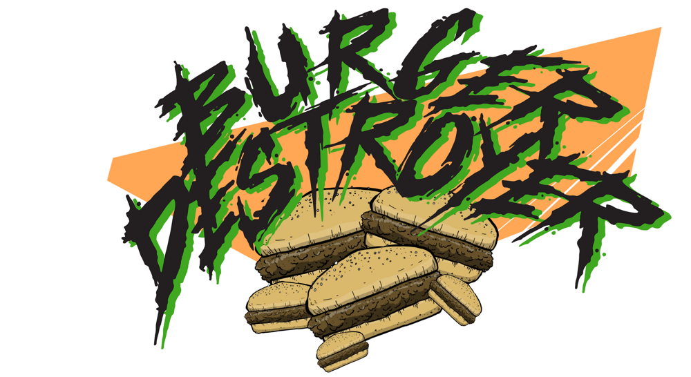
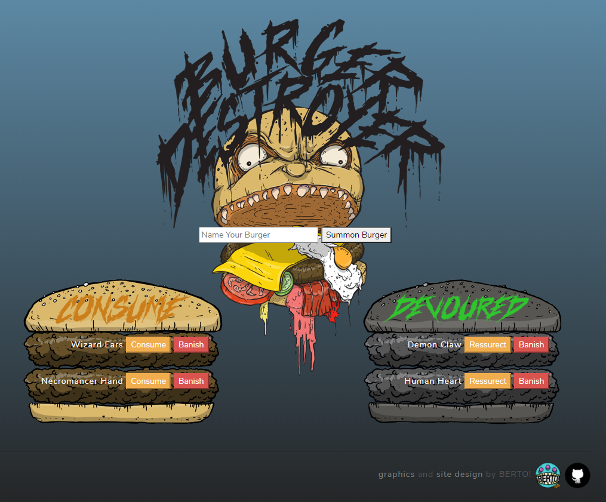
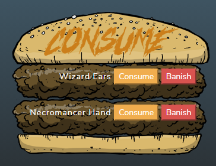

Burger Destroyer is a burger logger that allows users to input the names of burgers that they would like to eat! Once you have devoured that burger, you can mark it off your list! The log is persistent, which makes the information available to you when it is needed.

## Table of Contents

* [Description](#description)
* [Usage](#usage)
* [Screenshots](#screenshots)
* [Questions](#questions)

## Description

* Link to the Heroku deployed application - [Burger Destroyer](https://powerful-cliffs-00589.herokuapp.com/)
* Simple application powered by [Node.js](https://nodejs.org/en/), [Express](http://expressjs.com/) , [MySql](https://www.mysql.com/) , [Handlebars](https://handlebarsjs.com/)
* Built to follow the [MVC](https://en.wikipedia.org/wiki/Model%E2%80%93view%E2%80%93controller) (model-view-controller) software design pattern
* All illustrations created by `BERTO` (www.robertorubet.com)

## Usage

The site is fairly straightforward. You are allowed to input the name of a burger that you would like to consume, which gets logged in the left column under `CONSUME`. From there, you have a choice to `DEVOUR` the burger, which will move it over to the right column titled `DEVOURED`. At any point, you can decide to `BANISH` a burger, which will remove it from the list entirely.

## Screenshots

Screenshot of the page

Screenshot of an empty burger column

Screenshot of a populated burger column

## Questions

Feel free to get in touch with me if you have any questions or concerns.

Link to my GitHub Profile: [Bertodemus](https://github.com/bertodemus)

Email me at: [roberto@robertorubet.com](roberto@robertorubet.com)

